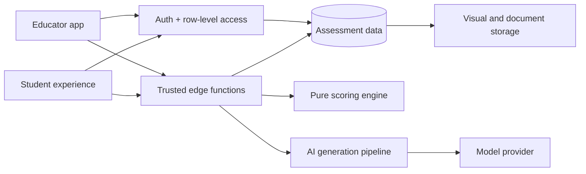
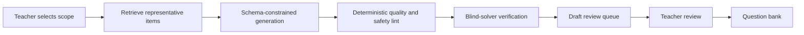

# Learning Intelligence Platform — architecture case study

An architecture case study for a mission-driven college-readiness platform that helps students understand strengths, readiness, and where to focus next.

> **Public case study, not the production source:** the implementation, question bank, scoring parameters, database schema, prompts, credentials, and operating data remain private. This repository explains the engineering approach and my contributions without exposing proprietary material.

## The mission

High-stakes entrance-exam preparation is often reduced to a score and a generic review plan. The system was designed around a more useful question: **what does this student understand, what is holding them back, and what should they study next?**

The platform connects three experiences:

- A timed student diagnostic that is resilient to refreshes and interrupted connections.
- An educator workspace for managing a question bank, designing exam blueprints, reviewing content, and previewing the student experience.
- A scoring and recommendation system that turns responses into subject mastery, readiness signals, course-fit indicators, and an actionable study plan.

## My engineering contribution

I worked across the full stack:

| Area | Work represented in the private system |
|---|---|
| Frontend | React educator tools, exam and quiz builders, student preview, math and media rendering, exports |
| Backend | Authenticated edge functions for assembly, timing, answer submission, grading, finalization, and results |
| Data | Relational assessment model, immutable attempt snapshots, row-level access control, storage-backed visuals |
| Algorithms | Pure scoring pipeline, weighted mastery and readiness calculations, deterministic tie-breaking, regression tests |
| AI | Retrieval-grounded question generation, schema-constrained output, deterministic linting, blind-solver verification, human review |
| Reliability | Resume-safe sessions, disconnect-aware timing, build guards, testable pure functions, deployment handover documentation |

## Architecture at a glance

The browser can read only what its authenticated role is allowed to see. Correct answers, grading, scoring, and model credentials stay behind trusted functions.

## The AI quality pipeline

The important design choice is that AI output is a **candidate**, never an authority. A generated question has to survive deterministic checks, be solved independently without revealing the proposed answer, and be reviewed by a human before it can become active content.

## Engineering principles

- **Never send answer keys to the browser.** Grading happens in trusted server-side code.
- **Freeze attempts when they begin.** Editing an exam later cannot corrupt an in-progress student session.
- **Compute once, read many.** Finalization writes stable result records; results pages do not recalculate high-consequence scores on every request.
- **Keep scoring pure.** Domain calculations are isolated from database and network code, making boundary and regression testing practical.
- **Fail closed on AI quality.** Invalid, ambiguous, unsafe, or unverifiable candidates are rejected.
- **Humans own publication.** AI can accelerate drafting; educators remain accountable for content quality.
- **Treat rendering as domain logic.** Mathematics, diagrams, passages, and media need dedicated validation and regression guards.

## Read next

- [System architecture](docs/ARCHITECTURE.md)
- [AI generation and verification](docs/AI_PIPELINE.md)
- [Engineering decisions](docs/ENGINEERING_DECISIONS.md)
- [What remains private](DISCLOSURE.md)

## Skills demonstrated

React · JavaScript/TypeScript · Vite · Supabase · PostgreSQL · Auth · RLS · Deno edge functions · serverless architecture · Anthropic API · structured generation · retrieval grounding · AI evaluation · deterministic validation · testing · system design · technical documentation

## Author

Architecture and engineering by [Juanlo Policarpio](https://github.com/juanlopolicaarpio).

Copyright © 2026 Juanlo Policarpio. All rights reserved. See [LICENSE](LICENSE).
