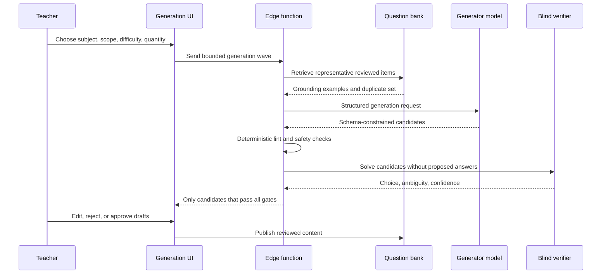

# AI question generation and verification

## Product rule

AI accelerates drafting. It does not decide what students see.

## Pipeline

## Grounding

The generator receives reviewed examples from the same subject and topic. This controls style and difficulty better than a generic prompt. Passage-based and visual questions carry additional context so the candidate remains answerable.

The public case study intentionally omits the retrieval queries, prompt templates, question content, and content rules.

## Structured generation

The model is required to return a known object shape rather than prose. A candidate includes a stem, choices, proposed answer, difficulty, and optional visual or passage references. Schema enforcement makes downstream checks deterministic.

## Deterministic gate

Before another model sees a candidate, code checks properties such as:

- Required fields and distinct choices.
- Valid answer labels.
- Minimum content length.
- Duplicate stems within the bank and current batch.
- Safe, self-contained vector graphics when applicable.
- Sufficient passage context for reading items.

Cheap deterministic rejection happens before expensive model verification.

## Blind-solver gate

The verifier receives the complete question but not the proposed answer. It must independently choose an answer, state whether the item has a single defensible solution, and report confidence. A candidate survives only when the independent result agrees and ambiguity is acceptably low.

This does not make model output infallible. It reduces obvious answer-key and ambiguity failures and creates a measurable quality funnel.

## Human review

Surviving candidates remain drafts. Educators can edit, regenerate, reject, and approve. Publication is a human-controlled state transition.

## Evaluation strategy

- Acceptance rate at each pipeline stage.
- Rejection reasons by subject and difficulty.
- Agreement between proposed and independently solved answers.
- Human edit and rejection rates.
- Duplicate and unsafe-output rates.
- Cost and latency per accepted question.
- Post-publication issue rate compared with human-authored content.

## Failure posture

The pipeline fails closed. Missing grounding, invalid structured output, unsafe visuals, provider failures, and low-confidence verification return fewer or no candidates rather than unreviewed content.
