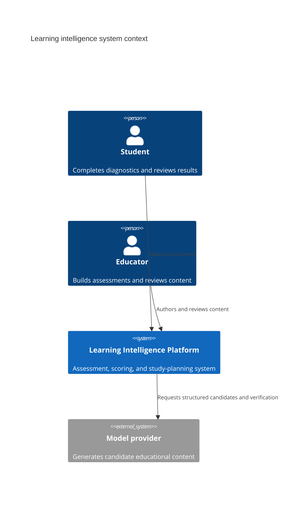
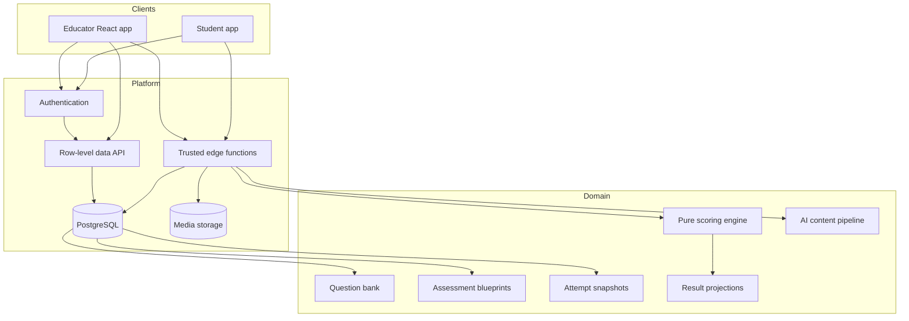
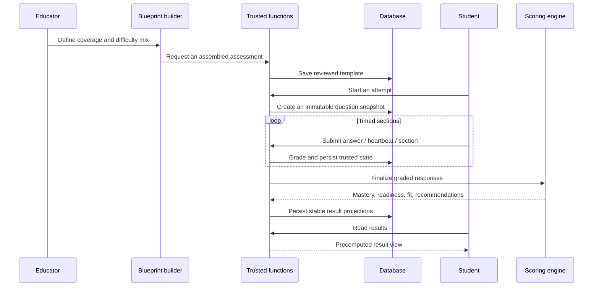

# System architecture

## System context

## Container view

## Assessment lifecycle

## Trust boundaries

### Browser-safe responsibilities

- Render allowed questions, passages, mathematics, diagrams, and progress.
- Manage educator drafting state and client-side interaction.
- Send signed requests and display server-authorized results.

### Trusted-function responsibilities

- Authenticate the caller and enforce ownership.
- Read answer keys, grade responses, and finalize attempts.
- Call external models using server-held credentials.
- Validate structured AI output and enforce publication state.

### Database responsibilities

- Row-level access control.
- Referential integrity and attempt ownership.
- Durable snapshots and result projections.
- Audit-friendly content and status transitions.

## Why serverless fit this product

The platform needed trusted operations but not a permanently running custom server. Edge functions provided small, independently deployable security boundaries around grading, finalization, and AI calls while the frontend used authenticated row-level data access for ordinary educator workflows.

The tradeoff is deployment coordination: shared function code must be redeployed anywhere it is bundled, and cross-record operations need deliberate transactional design.
